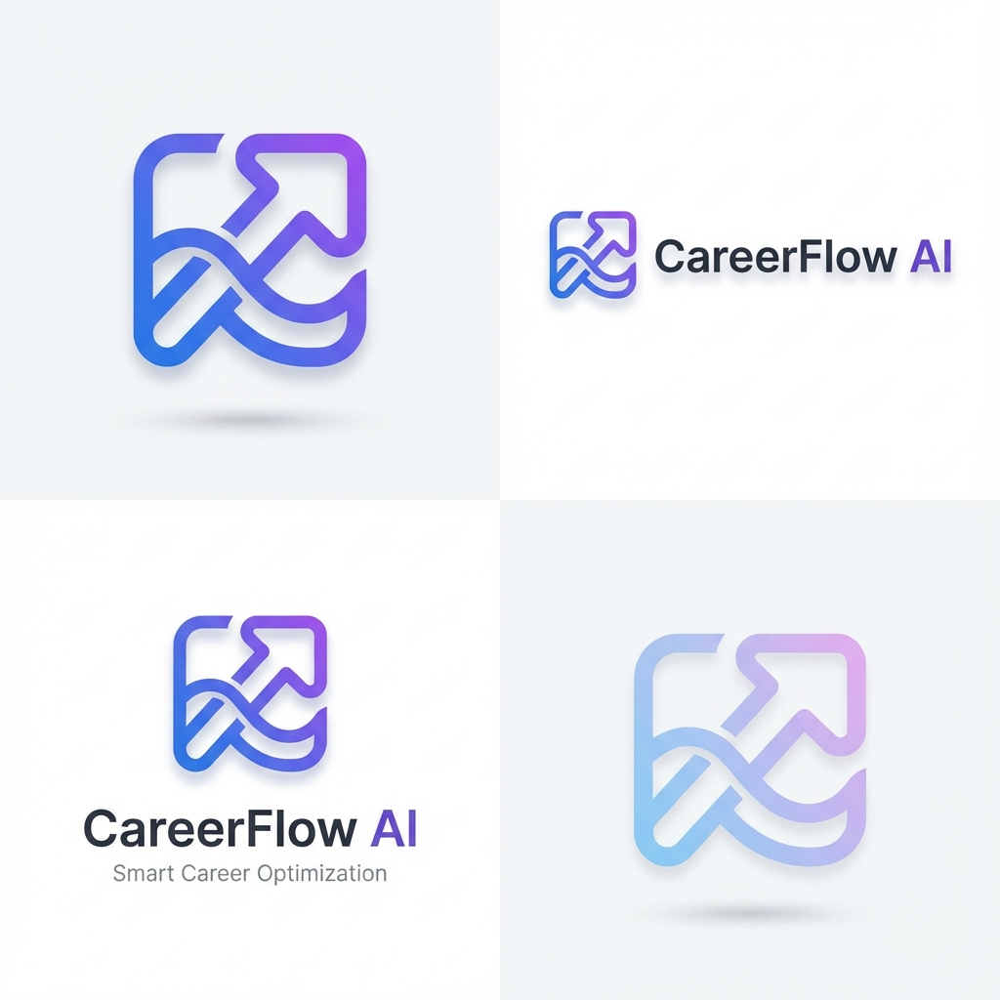

# ProLink AI 🚀

**ProLink AI** is a comprehensive, AI-powered career optimization platform designed to help developers and professionals elevate their professional presence. By determining the strengths and weaknesses of your CV, LinkedIn profile, and GitHub activity, ProLink AI provides actionable, AI-driven insights to help you land your dream job.



## ✨ Key Features

### 1. 📄 AI CV Optimization
- **PDF/DOCX Upload:** Drag & drop your resume directly into the dashboard.
- **Smart Parsing:** Automatically extracts text from complex layouts using PDF parsing technology.
- **AI Analysis:** Uses **Google Gemini 1.5 Flash** to score your CV against ATS algorithms.
- **Detailed Report:** Receives a section-by-section breakdown with actionable improvements.

### 2. 💼 LinkedIn Profile Booster
- **URL Analysis:** Simply paste your LinkedIn profile URL (e.g., `linkedin.com/in/username`).
- **Profile Scraping:** Puppeteer-powered agent visits your public profile to understand your current branding.
- **Content Optimization:** Rewrites your 'About' section to be more engaging, professional, and SEO-friendly.
- **Post Suggestions:** Generates viral-worthy post ideas tailored to your industry.

### 3. 🐙 GitHub Audit
- **Deep Repo Scan:** Analyzes your public repositories, commit history, and language usage.
- **Tech Stack Detection:** Identifies your top languages and frameworks.
- **AI Code Review:** Provides a "Senior Developer" assessment of your coding style and project quality.
- **Visual Stats:** Beautiful charts displaying your contribution heatmap and language distribution.

---

## 🛠️ Tech Stack

### Frontend
- **Framework:** [Next.js 14](https://nextjs.org/) (App Router)
- **Styling:** TailwindCSS, Framer Motion (for animations)
- **Icons:** Lucide React
- **HTTP Client:** Axios

### Backend
- **Runtime:** Node.js
- **Framework:** Express.js
- **AI Integration:** Google Gemini API (`gemini-flash-latest`) via REST
- **Scraping:** Puppeteer (Headless Chrome)
- **Parsing:** `pdf-parse`, `mammoth`

### Deployment
- **Docker:** Fully containerized architecture (Frontend + Backend)
- **Orchestration:** Docker Compose

---

## 🚀 Getting Started

### Prerequisites
- Node.js 18+
- Docker (optional, for containerized run)
- Google Gemini API Key

### Installation

1. **Clone the repository**
   ```bash
   git clone https://github.com/your-username/ProLink-AI.git
   cd ProLink-AI
   ```

2. **Backend Setup**
   ```bash
   cd backend
   npm install
   # Create .env file with your API key
   echo "GEMINI_API_KEY=your_key_here" > .env
   npm start
   ```

3. **Frontend Setup**
   ```bash
   cd frontend
   npm install
   npm run dev
   ```

4. **Access the App**
   Open [http://localhost:3000](http://localhost:3000) in your browser.

---

## 🐳 Docker Support

Run the entire stack with a single command:

```bash
docker-compose up --build
```

---

## 🛡️ License

This project is open-source and available for personal and educational use.
